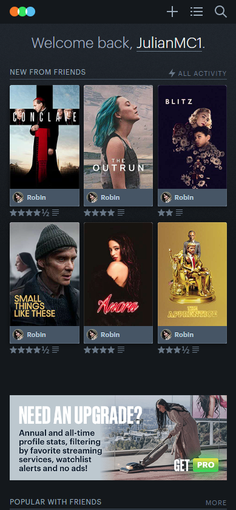
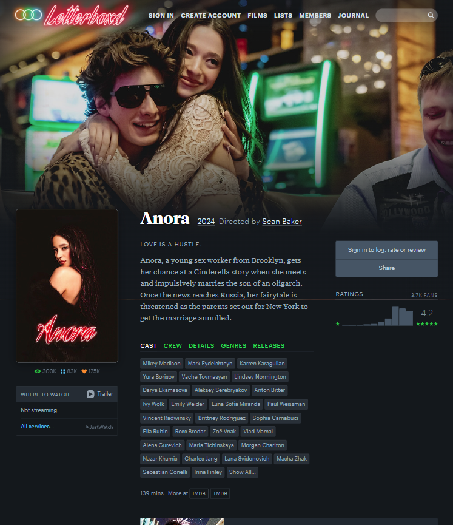
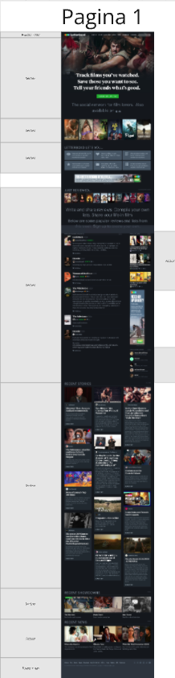
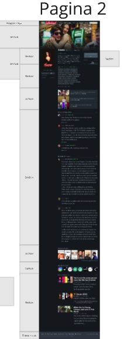
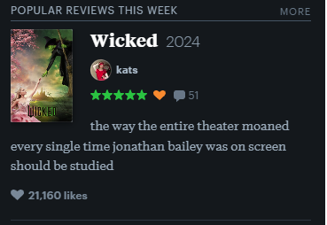
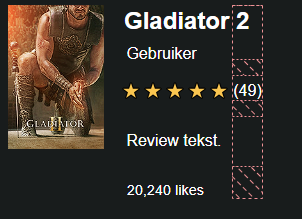

# Procesverslag
Markdown is een simpele manier om HTML te schrijven.  
Markdown cheat cheet: [Hulp bij het schrijven van Markdown](https://github.com/adam-p/markdown-here/wiki/Markdown-Cheatsheet).

Nb. De standaardstructuur en de spartaanse opmaak van de README.md zijn helemaal prima. Het gaat om de inhoud van je procesverslag. Besteedt de tijd voor pracht en praal aan je website.

Nb. Door *open* toe te voegen aan een *details* element kun je deze standaard open zetten. Fijn om dat steeds voor de relevante stuk(ken) te doen.

## Jij

  
uitwerken voor kick-off werkgroep

  ### Auteur:
  Julian Meijer

  #### Je startniveau:
  Blauw of Rood (nog niet zeker)

  #### Je focus:
  surface plane
 

## Je website

  
uitwerken voor kick-off werkgroep

  ### Je opdracht:
  Pagine 1: https://letterboxd.com
  Pagina 2: https://letterboxd.com/film/gladiator-ii/

  #### Screenshot(s) van de eerste pagina (small screen): 
  hier de naam van de pagina  
  

  #### Screenshot(s) van de tweede pagina (small screen):
  hier de naam van de pagina  
  
 

d

## Toegankelijkheidstest 1/2 (week 1)

  
uitwerken na test in 2e werkgroep

  ### Bevindingen
  Lijst met je bevindingen die in de test naar voren kwamen:

## Breakdownschets (week 1)

  
uitwerken na afloop 3e werkgroep

  ### de hele pagina: 
  

   ### de hele pagina 2: 
  

  ### dynamisch deel (bijv menu): 
   
<!-- ?? -->
  ### wellicht nog een dynamisch deel (bijv filter): 
  
<!-- ?? -->

## Voortgang 1 (week 2)

  
groep: Julian, Joshua en Alyciae voortgang

  ### Stand van zaken
  hier dit ging goed & dit was lastig (neem ook screenshots op van delen van je website en code)

  ### Agenda voor meeting
  samen met je groepje opstellen

  Joshua:
  - Wanneer nieuwe sectie, wanneer past dit?
  - tekst selecteren met toetsenbord?
  - Wanneer grid, wanneer flexbox?
  - Breakdownschets

  Julian:
  - Wanneer grid en wanneer flex?
  - Wat wordt er verwacht qua toegankelijkheid? 
  - Het minimale aantal van 3 CSS files. Hoe werkt dat?
  - functies binnen de websites (surface planes)

  -Alycia:
  - Tekst op een image

  ### Verslag van meeting
  hier na afloop snel de uitkomsten van de meeting vastleggen

  - Koppel meerdere CSS files op 1 html file. 
  - Bekijk opdracht voor duidelijkheid surface plane.
  - Duidelijk over grid en flex gebruik.

## Voortgang 2 (week 3)

  
groep: Julian, Joshua en Jooste voortgang

  ### Stand van zaken
  hier dit ging goed & dit was lastig (neem ook screenshots op van delen van je website en code)

  ### Agenda voor meeting
  samen met je groepje opstellen

  Joshua:
  - Fonts (hoe toe te voegen vanuit file, mag ook vanuit adobe fonts ook met js?)
  - iconen die geen images zijn?
  - image uit de section achter elementen van de header?

  Julian:
  - Welke vorm van afbeeldingen zijn het beste voor toegankelijkheid?

  Joost:
  - 

  ### Verslag van meeting
  hier na afloop snel de uitkomsten van de meeting vastleggen

  - Grid is beter uigelegd hoe je opdeelt over een pagina (afbeeldingen)
  - clamp is uitgelgd. Gekeken naar hoe een iets kleiner en groter kan worden op basis van een minimum en maxinum van een scherm grootte. -> daarmee verandert er iets zoals bijvoorbeeld in dit geval tekst grootte.
  - verwijst naar a11y project voor header.

## Toegankelijkheidstest 2/2 (week 4)

  
uitwerken na test in 9e werkgroep

  ### Bevindingen
  Lijst met je bevindingen die in de test naar voren kwamen (geef ook aan wat er verbeterd is):

## Voortgang 3 (week 4)

  
Julian, Joshua en Mohammede voortgang

  ### Stand van zaken
  Deze les was vooral besteed aan GitHub regelen voor mij.

  ### Agenda voor meeting
  Voor Joshua werd er naar zijn Grit gekeken en voor Mohammed zijn Hamburger menu.
  Mijn Github werkte niet goed, dus daar werd deze les aan besteed

  ### Verslag van meeting
 Github werkend gekregen. Studenten assistent wist niet wat er gebeurde of wat er fout ging, maar met aantal trial en error kwam het goed.

## Eindgesprek (week 5)

  
uitwerken voor eindgesprek

  ### Je uitkomst - karakteristiek screenshots:
  

  ### Dit ging goed/Heb ik geleerd: 
  Wat ik vooral heb geleerd is het gebruik maken van nth en het vermijden van Classes en ID. Alleen ben ik me niet van bewust wat het nut ervan is. Ik ga er van uit dat Classes en ID niet toegangkelijk zijn.
  

  ### Dit was lastig/Is niet gelukt:
  Korte omschrijving met plaatjes

  
    

## Bronnenlijst

  
continu bijhouden terwijl je werkt

  Nb. Wees specifiek ('css-tricks' als bron is bijv. niet specifiek genoeg). 
  Nb. ChatGpT en andere AI horen er ook bij.
  Nb. Vermeld de bronnen ook in je code.

  1. /* Hamburger menu BRON: https://www.youtube.com/watch?v=aNDqzlAKmZc */
  2. ...
  3. ...

